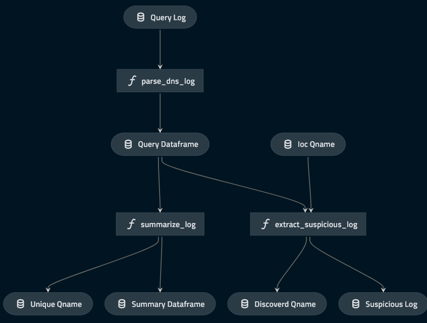

# `investigate-dnslog` starter

## 💡 Overview
The code in this repository demonstrates simple Incident Response workflow for metemcyber.  
This code is created by [kedro](https://github.com/quantumblacklabs/kedro).

## About this workflow


The pipline includes 2 module piplines:
* parse_dnslog
    * Parse Bind9 query log and create dataframe, and sumamrize it.
* explore_using_iocs
    * Search suspicious query log which that match iocs.

## Required data to run this workflow
To run this workflow, two file need to be located in `data/01_raw/` directory.

### query.log
Bind9 query log file. This workflow search suspicious query log from this file.


### iocs.txt
List of domain name you want to search from query log.  
The following is an example of the contents of this file:
```
malicious.example
suspicious.test
```