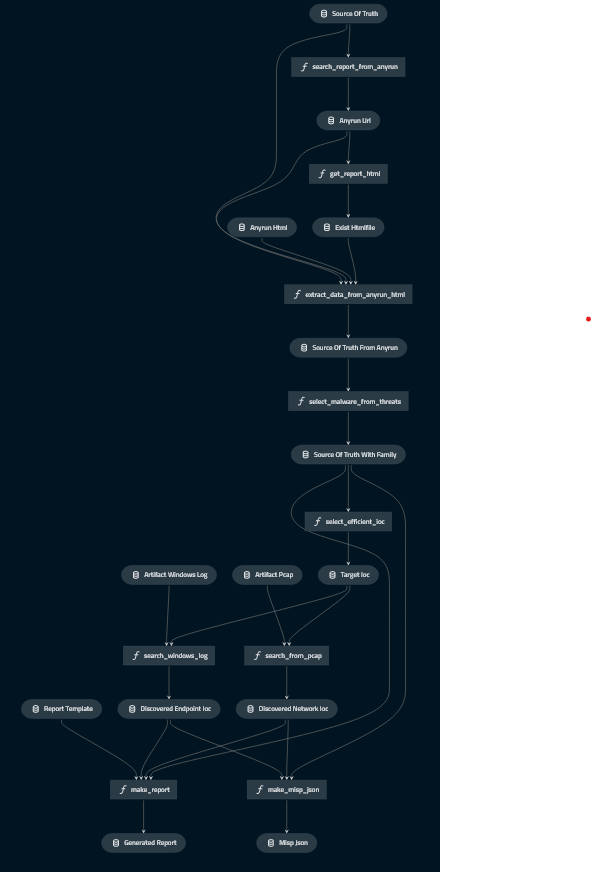

# `ir-exercise` starter

## 💡 Overview
The code in this repository demonstrates simple Incident Response workflow for metemcyber.  
This code is created by [kedro](https://github.com/quantumblacklabs/kedro).

## About this workflow

The pipline includes 6 module piplines:
* get_report_from_sandbox
    * Search anyrun using hash value, and get report.
* detect_malware_category
    * Detect malware family name from any.run report.       
* export_malware_specific_ioc
    * Export malware specific IOCs from any.run report.
* detect_malware_infection
    * Investigate if there are logs thath match the IOCs.
* make_report
    * Make report from IOCs and logs.

